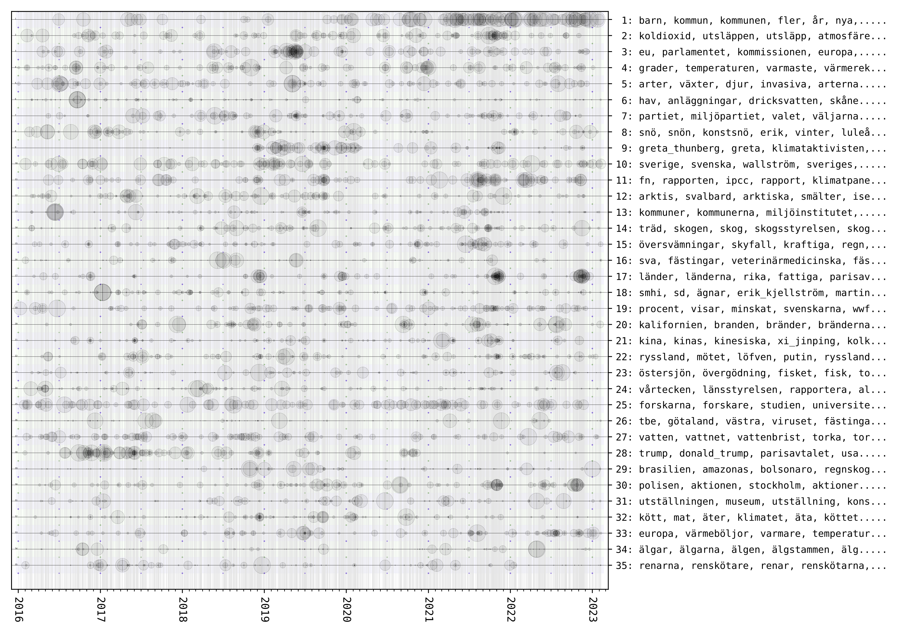

topic-timelines
===============
This timeline visualisation visualises the occurrence of topics over time. It uses the output of the Topics2Themes tool, which extracts topics from a text corpus. The occurrence of these topics are visualised. 

To run the code, you therefore first need to run Topics2Themes on a text collection, and then run the code here on the output from this tool. You find Topics2Themes at here: https://github.com/mariask2/topics2themes

An example of how to run the code is given in `plot_climate_timeline.py'. 

The code uses `numpy' and `matplotlib'.

The visualisation has been used for providing an overview of the content of several different types of corpora. The code is, however, still under development.

