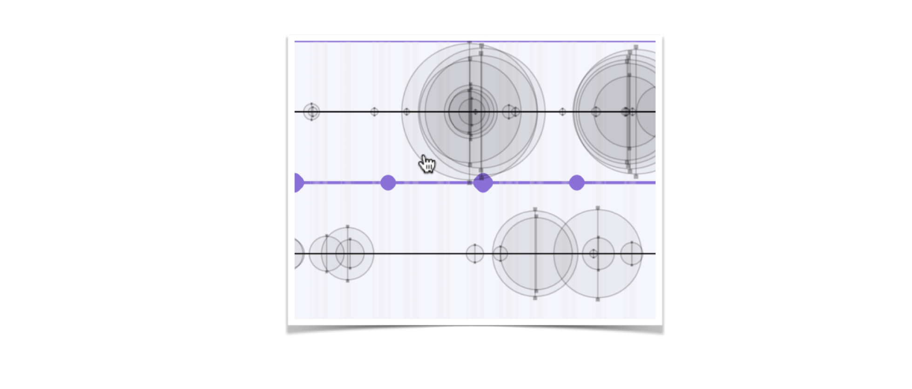

Topic Timelines
===============
This timeline visualises the prevalence of topics over time, as well as the prominence of the topics in the texts. 

The tool is independent of topic modelling algorithm. But you can, for instance, use the Topics2Themes tool, which automatically extracts topics from a text corpus. To connect it to the output of Topics2Themes, you need this tool, which you can find at: [https://github.com/mariask2/topics2themes](https://github.com/mariask2/topics2themes)

An example of how to run the code (and what is needed for configuring the Topics2Themes tool) is given in . 

Dependencies
-------------

The code uses `numpy` and `matplotlib`.

The visualisation has been used for providing an overview of the content of several different types of corpora. The code is, however, still under development. The following examplifies the timeline visualisation for a corpus consisting of Swedish news about climate change. The y-axis shows the 39 topics that were automatically extracted from the corpus and the x-axis shows the date associated with the texts in the corpus. Each text is represented by a vertical line. The circles represent the level of association between the topic and the text. The larger the circle, the closer the association. Many overlapping circles at a certain date indicates that many texts on this topic were published this date. 

It is possible to associate a unique hyperlink to each text that has been used for generating the timeline. The circles then become clickable links, which direct you to the web page associated with the text, for instance a web page that contains the text with its original layout. It is thereby possible to use the visualisation as a tool for locating and selecting potentially interesting texts for close reading.

## Acknowledgements
The work on topic-timelines has mainly been conducted within the project ActDisease, partly with support from the research infrastructures InfraVis and Huminfra.

- [ActDisease](https://www.actdisease.org): Acting out Disease: How Patient Organizations Shaped Modern Medicine: ERC Starting Grant (ERC-2021-STG 101040999)
- [InfraVis](https://infravis.se): the Swedish National Research Infrastructure for Data Visualization (Swedish Research Council, 2021-00181)
- [Huminfra](https://www.huminfra.se): National infrastructure for Research in the Humanities and Social Sciences (Swedish Research Council, 2021-00176)

